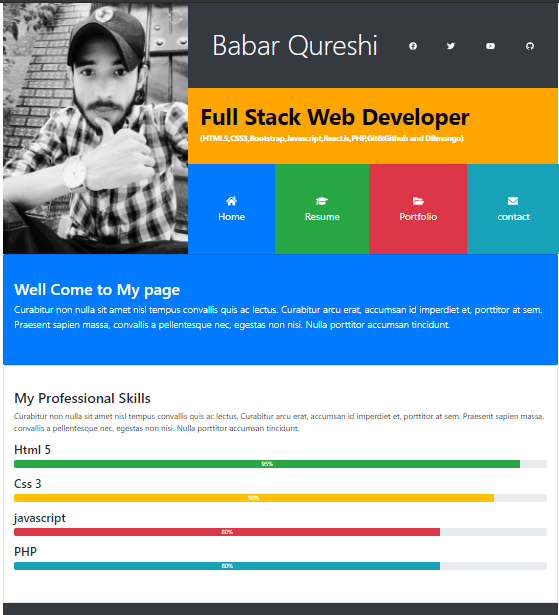
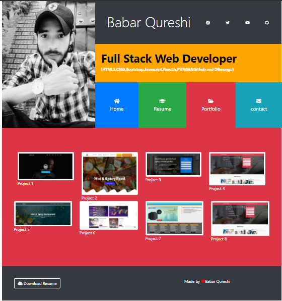
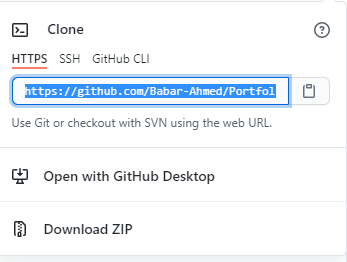

# Portfolio.github.io

# Portfolio Website 

<b>Portfolio website in Bootstrap4 its the complete personal website you can add your personal Data Educaiton
Skills and Work</b>

## Fucaitonality 
<b>
<li>Resume</li>
<li>Education</li>
<li>Skills </li>
<li>Experiences</li></b>

## Tech Stack
</b>
<li>HTML5</li>
<li>CSS3</li>
<li>Bootstrap 4.5</li>
<li>Javascript ES6</li>
<li>Github Actions</li></li>
<li>Github Pages</li>

## Clone Repo
https://github.com/Babar-Ahmed/Portfolio.github.io.git

<b>click repo then click code and selecte the url of the repo
goto cmd command propmt type git clone "past here repo url"</b>
